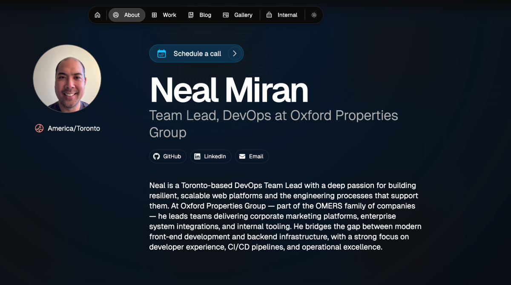

# Magic Portfolio

Magic Portfolio is a simple, clean, beginner-friendly portfolio template. It supports an MDX-based content system for projects and blog posts, an about / CV page and a gallery.

View the demo [here](https://demo.magic-portfolio.com).



## Getting started

**1. Clone the repository**
```
git clone https://github.com/once-ui-system/magic-portfolio.git
```

**2. Install dependencies**
```
npm install
```

**3. Run dev server**
```
npm run dev
```

**4. Edit config**
```
src/resources/once-ui.config.js
```

**5. Edit content**
```
src/resources/content.js
```

**6. Create blog posts / projects**
```
Add a new .mdx file to src/app/blog/posts or src/app/work/projects
```

Magic Portfolio was built with [Once UI](https://once-ui.com) for [Next.js](https://nextjs.org). It requires Node.js v18.17+.

## Documentation

Docs available at: [docs.once-ui.com](https://docs.once-ui.com/docs/magic-portfolio/quick-start)

## Features

### Once UI
- All tokens, components & features of [Once UI](https://once-ui.com)

### SEO
- Automatic open-graph and X image generation with next/og
- Automatic schema and metadata generation based on the content file

### Design
- Responsive layout optimized for all screen sizes
- Timeless design without heavy animations and motion
- Endless customization options through [data attributes](https://once-ui.com/docs/theming)

### Content
- Render sections conditionally based on the content file
- Enable or disable pages for blog, work, gallery and about / CV
- Generate and display social links automatically
- Set up password protection for URLs

### Localization
- A localized, earlier version of Magic Portfolio is available with the next-intl library
- To use localization, switch to the 'i18n' branch

## Testing

This project uses [Playwright](https://playwright.dev) for end-to-end testing across Chromium, Firefox, WebKit, and mobile viewports.

### Setup

Install browsers on first use:
```
npx playwright install
```

### Running tests

```bash
# Run all tests (all 5 browser projects)
npm test

# Run only Chromium (fastest for local dev)
npm run test:chromium

# Interactive UI mode
npm run test:ui

# Run with visible browser windows
npm run test:headed

# Open the last HTML report
npm run test:report
```

The test suite auto-starts the dev server (`npm run dev`) if one isn't already running on port 3000.

### Test coverage

| File | What's covered |
|------|---------------|
| `tests/e2e/navigation.spec.ts` | All public routes return 200, header/footer on every page, nav links, 404, theme |
| `tests/e2e/home.spec.ts` | Hero, CTA, featured project, blog posts, newsletter, console errors |
| `tests/e2e/about.spec.ts` | Heading, person name, avatar, social links, section structure |
| `tests/e2e/work.spec.ts` | Project index, all 5 public project detail pages, image 404 checks, protected project access |
| `tests/e2e/blog.spec.ts` | Blog index, both post detail pages, images, 404 for missing posts |
| `tests/e2e/gallery.spec.ts` | Images render, no 404s, lightbox, keyboard navigation |
| `tests/e2e/games.spec.ts` | Games hub, Chess (board, pieces, difficulty, moves), Tic-Tac-Toe (board, difficulties, moves, full game sequence) |
| `tests/e2e/auth.spec.ts` | Login page, all 3 internal routes blocked for unauthenticated users, `/api/check-auth` |
| `tests/e2e/api.spec.ts` | RSS feed (valid XML), sitemap (no internal routes exposed), robots.txt, OG image generation |
| `tests/e2e/seo.spec.ts` | `<title>`, meta description, Open Graph tags, JSON-LD schema, canonical URL, image alt attributes, keyboard focus |

## Creators

Lorant One: [Threads](https://www.threads.net/@lorant.one) / [LinkedIn](https://www.linkedin.com/in/lorant-one/)

## Get involved

- Join the Design Engineers Club on [Discord](https://discord.com/invite/5EyAQ4eNdS) and share your project with us!
- Deployed your docs? Share it on the [Once UI Hub](https://once-ui.com/hub) too! We feature our favorite apps on our landing page.

## License

Distributed under the CC BY-NC 4.0 License.
- Attribution is required.
- Commercial usage is not allowed.
- You can extend the license to [Dopler CC](https://dopler.app/license) by purchasing a [Once UI Pro](https://once-ui.com/pricing) license.

See `LICENSE.txt` for more information.

## Deploy with Vercel

[](https://vercel.com/new/clone?repository-url=https%3A%2F%2Fgithub.com%2Fonce-ui-system%2Fmagic-portfolio&project-name=portfolio&repository-name=portfolio&redirect-url=https%3A%2F%2Fgithub.com%2Fonce-ui-system%2Fmagic-portfolio&demo-title=Magic%20Portfolio&demo-description=Showcase%20your%20designers%20or%20developer%20portfolio&demo-url=https%3A%2F%2Fdemo.magic-portfolio.com&demo-image=%2F%2Fraw.githubusercontent.com%2Fonce-ui-system%2Fmagic-portfolio%2Fmain%2Fpublic%2Fimages%2Fog%2Fhome.jpg)